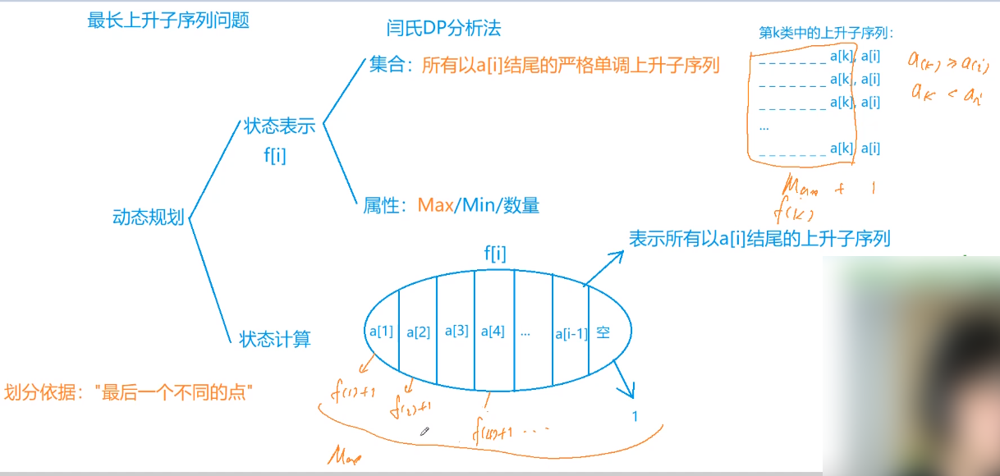
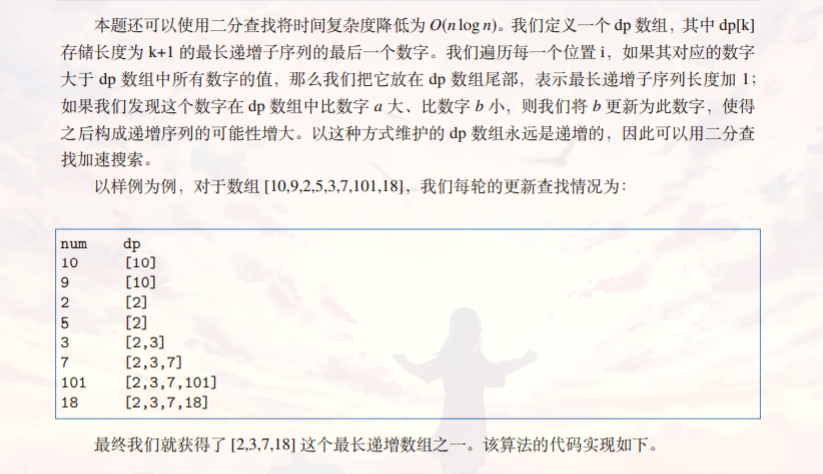
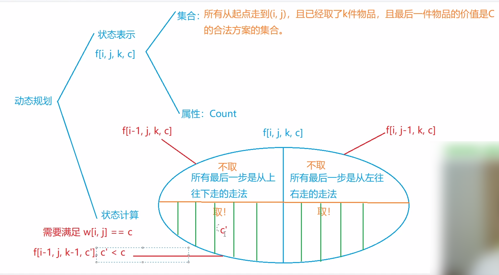

#### 2.4 acwing.895. 最长上升子序列（模板题）

最长上升子序列也是一类经典的DP问题。

Longest Increasing Sequence，简称LIS。 

<!--more-->

```C++
给定一个长度为 N 的数列，求数值严格单调递增的子序列的长度最长是多少。
    
输入格式
第一行包含整数 N。
第二行包含 N 个整数，表示完整序列。

输出格式
输出一个整数，表示最大长度。

数据范围
1≤N≤1000，
−10^9≤数列中的数≤10^9
输入样例：
7
3 1 2 1 8 5 6
输出样例：（1 2 5 6）
4
```

附上一份优秀题解：https://www.acwing.com/solution/content/4807/

##### 思路一：闫氏DP法



代码：

时间复杂度：O(n^2)。

```C++
//y总题解
#include <iostream>
#include <cstdio>
#include <algorithm>
using namespace std;

const int N = 1010;

int f[N],a[N];
int n;

int main(){
    scanf("%d",&n);
    for (int i = 1;i <= n;i++) scanf("%d",&a[i]);

    for (int i = 1;i <= n;i++){
        f[i] = 1;//边界初始条件，假设倒数第二个数不存在
        for (int j = 1;j < i;j++){
            if (a[j] < a[i]){
                f[i] = max(f[i],f[j]+1);
            }
        }
    }

    int res = 0;
    for (int i = 1;i <= n;i++) res = max(res,f[i]);
    printf("%d",res);
    return 0;
}
```

##### 思路二：DP+二分

时间复杂度：O(n*logn)。



- 状态表示：f[i]表示长度为i的最长上升子序列，末尾最小的数字。(长度为i的最长上升子序列所有结尾中，结尾最小min的) 即长度为i的子序列末尾最小元素是什么。


- 状态计算：对于每一个w[i], 如果大于`f[cnt-1]`(**下标从0开始**，cnt长度的最长上升子序列，末尾最小的数字)，那就cnt+1，使得最长上升序列长度+1，当前末尾最小元素为w[i]。 若w[i]小于等于f[cnt-1],说明不会更新当前的长度，但之前末尾的最小元素要发生变化，找到第一个大于或等于 (这里不能是大于) w[i]，更新以那时候末尾的最小元素。


- f[i]一定是一个单调递增的数组，所以可以用二分法来找第一个大于或等于w[i]的数字。（可以用STL）


```C++
#include <iostream>
#include <algorithm>
using namespace std;

const int N = 1010;

int f[N],w[N];
int n,cnt;
int main(){
    cin >> n;
    for (int i = 1;i <= n;i++) cin >> w[i];
    
    f[cnt++] = w[1];
    for (int i = 2;i <= n;i++){
        if (w[i] > f[cnt-1]) f[cnt++] = w[i];
        else{
            //注意二分的左边界一定要是f[0]
            int l = 0,r = cnt-1;
            while (l < r){
                int mid = l+r >> 1;
                if (w[i] <= f[mid]) r = mid;
                else l = mid + 1;
            }
            // STL写法
            //int r = lower_bound(f,f+cnt-1,w[i])-f;
            f[r] = w[i];
        }
    }
    cout << cnt << endl;
    return 0;
}
```

#### 2.5 acwing.1212. 地宫取宝

第五届蓝桥杯省赛C++A/B/C组,第五届蓝桥杯省赛JAVAB/C组

```C++
X 国王有一个地宫宝库，是 n×m 个格子的矩阵，每个格子放一件宝贝，每个宝贝贴着价值标签。
地宫的入口在左上角，出口在右下角。
小明被带到地宫的入口，国王要求他只能向右或向下行走。
走过某个格子时，如果那个格子中的宝贝价值比小明手中任意宝贝价值都大，小明就可以拿起它（当然，也可以不拿）。
当小明走到出口时，如果他手中的宝贝恰好是 k 件，则这些宝贝就可以送给小明。
请你帮小明算一算，在给定的局面下，他有多少种不同的行动方案能获得这 k 件宝贝。

输入格式
第一行 3 个整数，n,m,k，含义见题目描述。
接下来 n 行，每行有 m 个整数 Ci 用来描述宝库矩阵每个格子的宝贝价值。

输出格式
输出一个整数，表示正好取 k 个宝贝的行动方案数。
该数字可能很大，输出它对 1000000007 取模的结果。

数据范围
1≤n,m≤50,
1≤k≤12,
0≤Ci≤12
输入样例1：
2 2 2
1 2
2 1
输出样例1：
2
输入样例2：
2 3 2
1 2 3
2 1 5
输出样例2：
14
```

摘花生的拓展题。这道题有难度，其实是摘花生和最长上升子序列的结合题。

##### 思路一：闫氏DP法

注意：f数组表示的是满足条件的**方案个数**。



初始化条件：

1. `f(1,1,1,w(1,1)) = 1`，取第一件宝物，1种方案；
2. `f(1,1,0,-1） = 1`，不取第一件宝物，1种方案，下标不能为负数，要处理一下，设为-1是保证之后遇到的第一件任何宝物都能取到。（考虑-1到12，注意不能是0，题目Ci可以等于0且要求严格递增，转化为0到13）

```C++
#include <iostream>
#include <algorithm>
using namespace std;

const int N = 55,MOD = 1000000007;

int n,m,k;
int w[N][N];
int f[N][N][13][14];

int main(){
    cin >> n >> m >> k;

    for (int i = 1;i <= n;i++)
        for (int j = 1;j <= m;j++){
            cin >> w[i][j];
            w[i][j]++;
        }
    f[1][1][1][w[1][1]] = 1;
    f[1][1][0][0] = 1;

    for (int i = 1;i <= n;i++){
        for (int j = 1;j <= m;j++){
            if (i == 1 && j == 1) continue;
            for (int u = 0;u <= k;u++){
                for (int v = 0;v <= 13;v++){
                    //引用，因为要对数组修改
                    int &val = f[i][j][u][v];
                    //最多加上两个数取模，不然爆int
                    val = (val + f[i-1][j][u][v]) % MOD;
                    val = (val + f[i][j-1][u][v]) % MOD;
                    if (u > 0 && v == w[i][j]){
                        for (int c = 0;c < v;c++){
                            val = (val + f[i-1][j][u-1][c]) % MOD;
                            val = (val + f[i][j-1][u-1][c]) % MOD;
                        }
                    }
                }
            }
        }
    }

    int res = 0;
    for (int i = 0; i <= 13;i++) res = (res + f[n][m][k][i]) % MOD;
    cout << res << endl;
    return 0;
}
```

##### 思路二

附上一份大佬题解：https://www.acwing.com/solution/content/7116/

这两种方法都是枚举当前状态 第一种方法是不是就是由当前状态往前推 第二种就是由当前状态往后推 也就是 1. 之前——> 当前 2. 当前——> 后面

y总的DP分析就是由当前状态往前推。

两种枚举方法最好都要掌握。