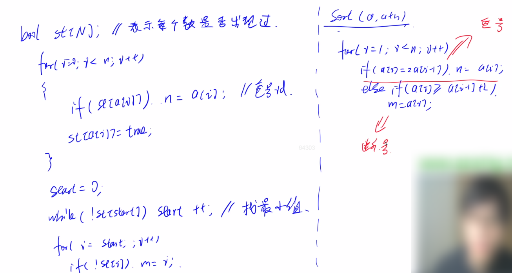

### 2.模拟

#### 2.1 acwing.1204. 错误票据

第四届蓝桥杯省赛C++A/B组,第四届蓝桥杯省赛JAVAA/B组

<!--more-->

```C++
某涉密单位下发了某种票据，并要在年终全部收回。
每张票据有唯一的ID号。
全年所有票据的ID号是连续的，但ID的开始数码是随机选定的。
因为工作人员疏忽，在录入ID号的时候发生了一处错误，造成了某个ID断号，另外一个ID重号。
你的任务是通过编程，找出断号的ID和重号的ID。
假设断号不可能发生在最大和最小号。

输入格式
第一行包含整数 N，表示后面共有 N 行数据。
接下来 N 行，每行包含空格分开的若干个（不大于100个）正整数（不大于100000），每个整数代表一个ID号。

输出格式
要求程序输出1行，含两个整数 m,n，用空格分隔。
其中，m表示断号ID，n表示重号ID。

数据范围
1≤N≤100
输入样例：
2
5 6 8 11 9 
10 12 9
输出样例：
7 9
```

思路：

这题关键在于输入的处理问题。

两种解法，时间差不多。



断号：应该是`m = a[i]-1`。

```C++
// 题解1，y总代码
#include <iostream>
#include <cstdio>
#include <algorithm>
#include <string>
#include <sstream>

using namespace std;

const int N = 100010;
int n;
int a[N];

int main(){
    int cnt;
    string line;

    cin >> cnt;
    getline(cin,line);
    while (cnt --){
        getline(cin,line);
        stringstream ssin(line);
        while (ssin >> a[n]) n++;
    }

    sort(a,a+n);
    int res1,res2;
    for (int i = 1;i < n;i++){
        if (a[i] == a[i-1]) res2 = a[i]; // 重号
        else if (a[i] == a[i-1] + 2) res1 = a[i]-1; // 断号
    }

    cout << res1 << ' ' << res2 <<endl;
    return 0;
}
------------
// 题解2
// 找出最大和最小的数，同时再用一个数组记录每个数字的个数，最后遍历一遍即可
#include <iostream>
#include <cstdio>
#include <cstring>
#include <algorithm>
using namespace std;
const int N=10010,M=100010;

int cnt[M];

int main(){
    int line,i=0,Min=100001,Max=0,a;
    int n,m; //m表示断号ID，n表示重号ID
    cin>>line;
    while(line--){
        while(cin>>a){
            cnt[a]++;
            Max=max(Max,a);
            Min=min(Min,a);
        }
    }

    for(int j=Min;j<Max;j++){
        if(cnt[j]==0) m=j;
        else if(cnt[j]==2) n=j;
    }

    cout<<m<<" "<<n<<endl;
    return 0;
}
```

#### 2.2 acwing.466. 回文日期

NOIP2016普及组

```C++
在日常生活中，通过年、月、日这三个要素可以表示出一个唯一确定的日期。
牛牛习惯用 8 位数字表示一个日期，其中，前 4 位代表年份，接下来 2 位代表月份，最后 2 位代表日期。
显然：一个日期只有一种表示方法，而两个不同的日期的表示方法不会相同。
牛牛认为，一个日期是回文的，当且仅当表示这个日期的 8 位数字是回文的。
现在，牛牛想知道：在他指定的两个日期之间（包含这两个日期本身），有多少个真实存在的日期是回文的。
一个 8 位数字是回文的，当且仅当对于所有的 i(1≤i≤8) 从左向右数的第 i 个数字和第 9−i 个数字（即从右向左数的第 i 个数字）是相同的。

例如：
对于 2016 年 11 月 19 日，用 8 位数字 20161119 表示，它不是回文的。
对于 2010 年 1 月 2 日，用 8 位数字 20100102 表示，它是回文的。
对于 2010 年 10 月 2 日，用 8 位数字 20101002 表示，它不是回文的。
输入格式
输入包括两行，每行包括一个 8 位数字。

第一行表示牛牛指定的起始日期 date1，第二行表示牛牛指定的终止日期 date2。保证 date1 和 date2 都是真实存在的日期，且年份部分一定为 4 位数字，且首位数字不为 0。
保证 date1 一定不晚于 date2。

输出格式
输出共一行，包含一个整数，表示在 date1 和 date2 之间，有多少个日期是回文的。

输入样例：
20110101
20111231
输出样例：
1
```

思路：

1. 先枚举回文数（1000~9999）
2. 再判断是否在给定范围内
3. 最后判断日期是否合法

```C++
// y总题解
#include <iostream>
using namespace std;

int days[13] = {0,31,28,31,30,31,30,31,31,30,31,30,31};

bool check_valid(int date){
    int y = date / 10000;
    int m = date % 10000 / 100;
    int d = date % 100;

    if (m == 0 || m >= 13) return false;
    if (d == 0 || d > days[m] && m != 2) return false;
    if (m == 2){
        int leap = y % 100 && y % 4 == 0 || y % 400 == 0;
        if (d > 28 + leap) return false;
    }
    return true;
}
int main(){
    int date1,date2;
    cin >> date1 >> date2;

    int res = 0;
    for (int i = 1000;i < 10000;i++){
        int date = i,x = i;
        for (int j = 0;j < 4;j++) date = date*10 + x%10,x /= 10;
        if (date >= date1 && date <= date2 && check_valid(date)){
            res ++;
        }
    }
    cout << res;
    return 0;
}
```

### 3.排序

#### 3.1 acwing.787. 归并排序（模板题）

建议先看看这篇文章[two pointers思想与归并排序](https://www.grantdrew.top/posts/2aed1d1d.html)，会更好理解归并排序。

蓝桥杯里遇到要用快速排序解决的问题，一般用库函数sort就行了，在基础课再写快排。

<!--more-->

```C++
给定你一个长度为 n 的整数数列。
请你使用归并排序对这个数列按照从小到大进行排序。
并将排好序的数列按顺序输出。

输入格式
输入共两行，第一行包含整数 n。
第二行包含 n 个整数（所有整数均在 1∼109 范围内），表示整个数列。

输出格式
输出共一行，包含 n 个整数，表示排好序的数列。

数据范围
1≤n≤100000
输入样例：
5
3 1 2 4 5
输出样例：
1 2 3 4 5
```

思路：

归并排序的关键在于如何将两个区间合二为一。

我们要用到双指针算法。

时间复杂度：O(n*logn)。

将长度为n的数组递归，不断划分为两个子区间，一共logn层。

每一层又需要O(n)的时间复杂度进行扫描两个区间。

1. 先确定数组中点mid作为分界点
2. 再递归将数组分为两半排序
3. 最后归并，将两半数组有序合并

```C++
// y总题解
#include <iostream>
#include <cstdio>
#include <algorithm>
using namespace std;

const int N = 100010;
int q[N],tmp[N];// tmp临时存放合并的数组
void merge_sort(int q[],int l,int r){
    if (l >= r) return;

    int mid = l+r >> 1;
    merge_sort(q,l,mid),merge_sort(q,mid+1,r);// 递归

    int k = 0,i = l,j = mid + 1;// 合并两个有序数组
    while (i <= mid && j <= r){
        // 这里取等号使排序稳定
        if (q[i] <= q[j]) tmp[k++] = q[i++];
        else tmp[k++] = q[j++];
    }
    while (i <= mid) tmp[k++] = q[i++];
    while (j <= r) tmp[k++] = q[j++];

    for (int i = l,j = 0;i <= r;i++,j++) q[i] = tmp[j];// 合并后的数组存回q
}
int n;
int main(){
    scanf("%d",&n);

    for (int i = 0;i < n;i++) scanf("%d",&q[i]);

    merge_sort(q,0,n-1);
    for (int i = 0;i < n;i++) printf("%d ",q[i]);
    return 0;
}
```

```Python
# 题解2，python实现
n = int(input())
list1 = list(map(int, input().split()))

def merge_sort(list1):
    if len(list1) <= 1:
        return
    mid = len(list1) // 2
    # 将一个list分为两份地时候产生两个新list，L和R，从而避免了边界问题和映射时地对齐问题
    L = list1[:mid]
    R = list1[mid:]
    merge_sort(L)
    merge_sort(R)

    i = j = k = 0
    while i < len(L) and j < len(R):
        if L[i] <= R[j]:
            list1[k] = L[i]
            i += 1
        else:
            list1[k] = R[j]
            j += 1
        k += 1
    while i < len(L):
        list1[k] = L[i]
        k += 1
        i += 1
    while j < len(R):
        list1[k] = R[j]
        k += 1
        j += 1

if __name__ == "__main__":
    merge_sort(list1)
    for i in list1:
        print(i, end=" ")

作者：Crispin
链接：https://www.acwing.com/solution/content/4628/
来源：AcWing
著作权归作者所有。商业转载请联系作者获得授权，非商业转载请注明出处。
```