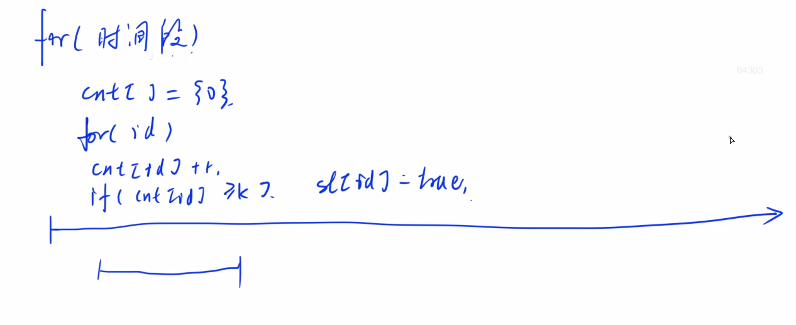
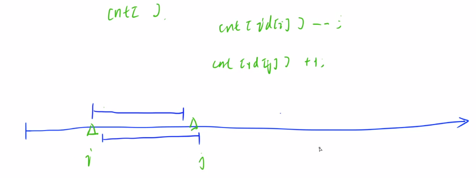
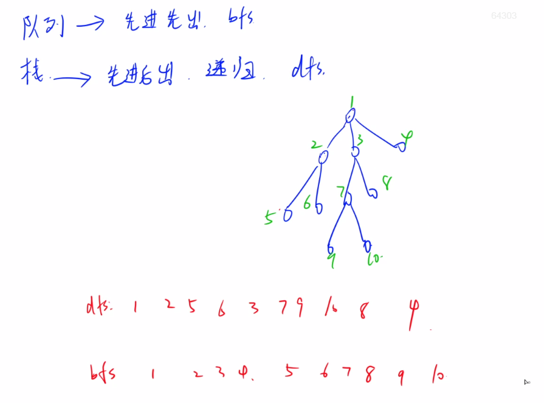
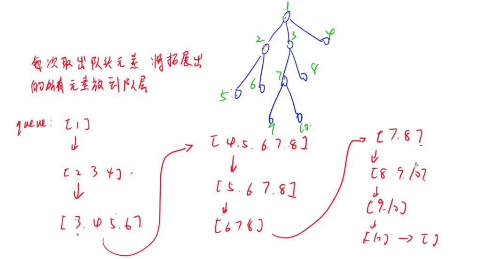
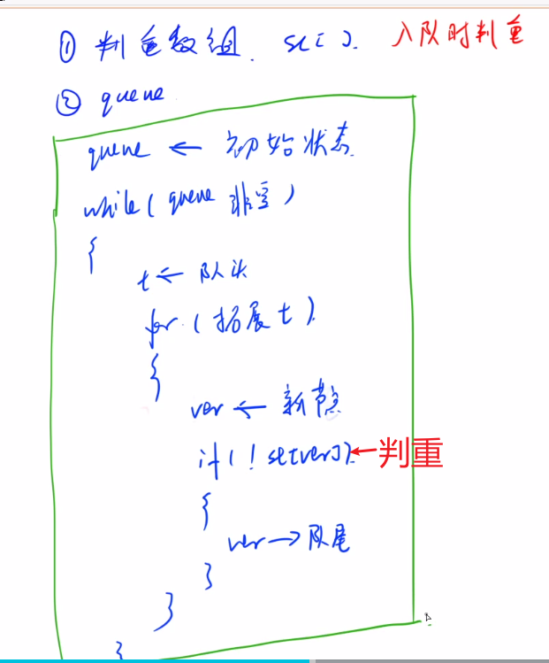
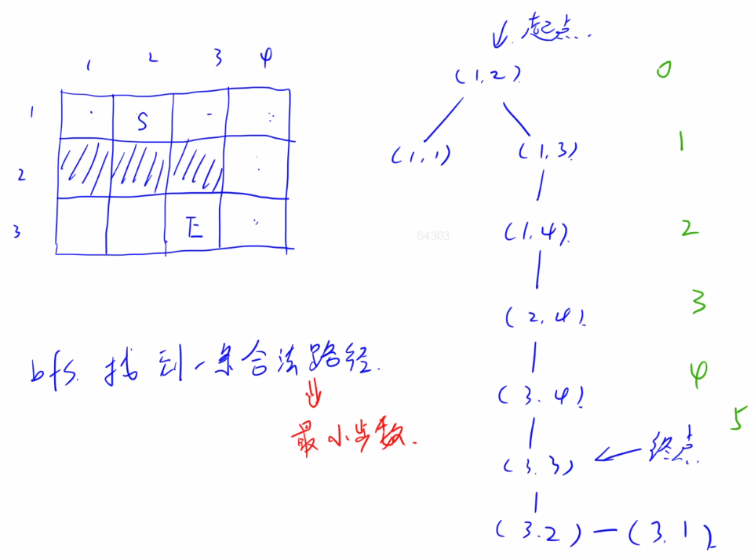

## 五 双指针、BFS与图论

暂时先跳过树状数组与线段树了。（在基础的算法中好像用不太多，比较高级）

### 1.双指针算法

双指针思想可以参考：[这篇文章](https://www.grantdrew.top/posts/2aed1d1d.html)。

语法课也简单介绍过第一类双指针算法。 

#### 1.1 acwing.1238. 日志统计

第九届蓝桥杯省赛C++B组,第九届蓝桥杯省赛JAVAB组

<!--more-->

```C++
小明维护着一个程序员论坛。现在他收集了一份”点赞”日志，日志共有 N 行。
其中每一行的格式是：
ts id  
表示在 ts 时刻编号 id 的帖子收到一个”赞”。
现在小明想统计有哪些帖子曾经是”热帖”。
如果一个帖子曾在任意一个长度为 D 的时间段内收到不少于 K 个赞，小明就认为这个帖子曾是”热帖”。
具体来说，如果存在某个时刻 T 满足该帖在 [T,T+D) 这段时间内(注意是左闭右开区间)收到不少于 K 个赞，该帖就曾是”热帖”。
给定日志，请你帮助小明统计出所有曾是”热帖”的帖子编号。

输入格式
第一行包含三个整数 N,D,K。
以下 N 行每行一条日志，包含两个整数 ts 和 id。

输出格式
按从小到大的顺序输出热帖 id。
每个 id 占一行。

数据范围
1≤K≤N≤10^5,
0≤ts,id≤10^5,
1≤D≤10000
输入样例：
7 10 2
0 1
0 10
10 10
10 1
9 1
100 3
100 3
输出样例：
1
3
```

思路：（这题和外卖优先级特别像）

暴力做法：枚举时间段，再枚举id，判断该时间段内每个id的点赞数量是否达到k，达到就退出，设为热帖。

最后枚举所有帖子，统计热帖数量。时间复杂度为O(n^2)。



然后再看看怎么优化？



统计时间段内每个id的点赞数量时，我们发现两个时间段会有重复计算的部分，可以优化，对于第2个时间段的点赞数量，只要再第1个时间段的基础上减去i时间的数量，再加上j时间的数量就行。

核心步骤：i在前面走，j跟着后面走，i和j维护长度不大于d的区间，若超过了d，则j前进进行区间回缩

```C++
#include <iostream>
#include <cstdio>
#include <algorithm>
#define x first
#define y second
using namespace std;// 放前面
typedef pair<int,int> PII;


const int N = 1e5+10;
PII logs[N];
int n,d,k;
bool st[N];// 热帖标志
int cnt[N];// 统计点赞数量
int main(){
    scanf("%d%d%d",&n,&d,&k);
    for (int i = 0;i < n;i++) scanf("%d %d",&logs[i].x,&logs[i].y);
    sort(logs,logs + n);// 对帖子按时间、id排序

    // 双指针算法，i走前面，j走后面
    for (int i = 0,j = 0;i < n;i++){
        int t = logs[i].y;
        cnt[t] ++;// id为t的帖子点赞+1
        while (logs[i].x - logs[j].x >= d){
            cnt[logs[j].y] --;// 当i和j时间跨度>=d时，j处的点赞失效
            j ++;// j向前移动
        }
        if (cnt[t] >= k) st[t] = true;
    }
    // 遍历所有帖子的id，输出热帖，id <= 1e5
    for (int i = 0;i < 1e5;i++) if (st[i]) printf("%d\n",i);
    return 0;
}
```

### 2.BFS算法

BFS，也即广度优先搜索。

深搜与宽搜的区别：BFS一般用队列实现，DFS一般用递归实现。



与树的遍历的关系：

DFS是先序遍历，BFS是层次遍历。

BFS算法过程：队列实现，加入和取出元素的顺序就是层次遍历。



模板：



y总推荐：CSAPP，神书，很费时间；算法导论，当字典查，有些东西已经过时。

#### 2.1 acwing.1101. 献给阿尔吉侬的花束（信息学奥赛一本通）

```C++
阿尔吉侬是一只聪明又慵懒的小白鼠，它最擅长的就是走各种各样的迷宫。
今天它要挑战一个非常大的迷宫，研究员们为了鼓励阿尔吉侬尽快到达终点，就在终点放了一块阿尔吉侬最喜欢的奶酪。
现在研究员们想知道，如果阿尔吉侬足够聪明，它最少需要多少时间就能吃到奶酪。
迷宫用一个 R×C 的字符矩阵来表示。
字符 S 表示阿尔吉侬所在的位置，字符 E 表示奶酪所在的位置，字符 # 表示墙壁，字符 . 表示可以通行。
阿尔吉侬在 1 个单位时间内可以从当前的位置走到它上下左右四个方向上的任意一个位置，但不能走出地图边界。

输入格式
第一行是一个正整数 T，表示一共有 T 组数据。
每一组数据的第一行包含了两个用空格分开的正整数 R 和 C，表示地图是一个 R×C 的矩阵。
接下来的 R 行描述了地图的具体内容，每一行包含了 C 个字符。字符含义如题目描述中所述。保证有且仅有一个 S 和 E。

输出格式
对于每一组数据，输出阿尔吉侬吃到奶酪的最少单位时间。
若阿尔吉侬无法吃到奶酪，则输出“oop!”（只输出引号里面的内容，不输出引号）。
每组数据的输出结果占一行。

数据范围
1<T≤10,
2≤R,C≤200
输入样例：
3
3 4
.S..
###.
..E.
3 4
.S..
.E..
....
3 4
.S..
####
..E.
输出样例：
5
1
oop!
```

思路：

根据数据范围，`T*R*C = 400,000`，时间复杂度应该是O(n)或O(logn)。

对于路径问题，BFS和DFS都能用，但只有BFS能找到一条合法的最短路径。



队列可以自己实现，也可以用STL（效率稍低，大部分题目差别不大）。

BFS：先把初始状态入队，然后进入循环，1.弹出队头 2.拓展队头的子节点( 判个重) ，然后压入队尾。

```C++
#include <cstdio>
#include <cstring>
#include <algorithm>
#include <iostream>
#include <queue>
using namespace std;
#define x first
#define y second
typedef pair<int,int> PII;

const int N = 210;
int n,m;
char g[N][N];
int dist[N][N];// 把判重和距离数组合为一个

int bfs(PII start,PII end){
    queue<PII> q;
    // 多个输入数据，每次重置dist数组
    memset(dist,-1,sizeof dist);// 把距离数组都初始化成-1，表示没走过

    if (end == start) return 0;
    dist[start.x][start.y] = 0;// 起点开始，距离为0
    q.push(start);// 起点 入队
    int dx[4] = {-1,0,1,0},dy[4] = {0,1,0,-1};// 设置四个方向的坐标偏移量
    while (q.size()){
        PII t = q.front();// 拿到队头
        q.pop();// 队头出队
        for (int i = 0;i < 4;i++){
            int x = t.x + dx[i],y = t.y + dy[i];
            if (x < 0 || x >= n || y < 0 || y >= m) continue;// 出界
            if (g[x][y] == '#') continue;// 撞墙
            if (dist[x][y] != -1) continue;// 判重，走过就不再计算
            
            dist[x][y] = dist[t.x][t.y] + 1;
            if (end == make_pair(x,y)) return dist[x][y];// 走到终点了，返回距离
            q.push(make_pair(x,y));
        }
    }
    return -1;
}

int main(){
    int t;
    scanf("%d",&t);
    while (t--){
        scanf("%d %d",&n,&m);
        for (int i = 0;i < n;i++) scanf("%s",g[i]);

        PII start,end;
        for (int i = 0;i < n;i++){
            for (int j = 0;j < m;j++){
                if (g[i][j] == 'S') start = make_pair(i,j);
                if (g[i][j] == 'E') end = make_pair(i,j);
            }
        }

        int distance = bfs(start,end);
        if (distance == -1) printf("oop!\n");
        else printf("%d\n",distance);
    }
    return 0;
}
```

