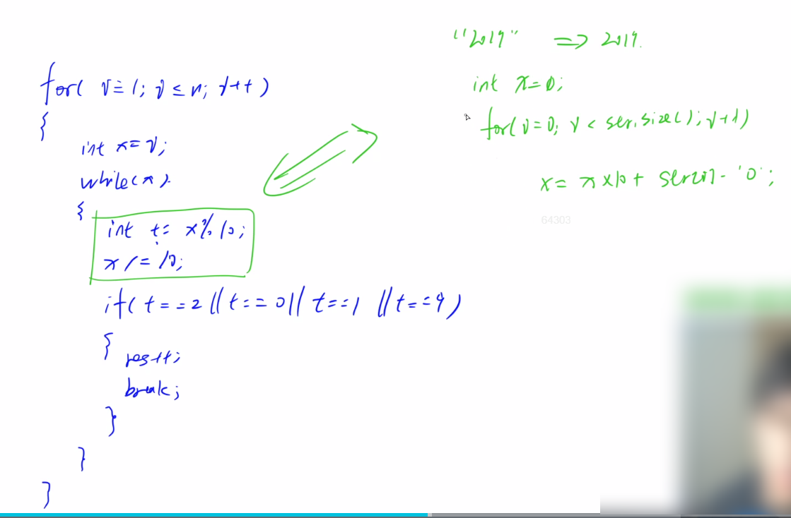

#### 1.2 acwing.1236. 递增三元组

第九届蓝桥杯省赛C++B组,第九届蓝桥杯省赛JAVAB组

<!--more-->

给定三个整数数组

$A=\left[A_{1}, A_{2}, \ldots A_{N}\right]$

$B=\left[B_{1}, B_{2}, \ldots B_{N}\right]$,

$C=\left[C_{1}, C_{2}, \ldots C_{N}\right]$
请你统计有多少个三元组 $(i, j, k)$ 满足:

1. $1 \leq i, j, k \leq N$
2. $A_{i}<B_{j}<C_{k}$

**输入格式**

第一行包含一个整数 $N$。

第二行包含 $N$ 个整数 $A_{1}, A_{2}, \ldots A_{N}$ 。

第三行包含 $N$ 个整数 $B_{1}, B_{2}, \ldots B_{N}$ 。

第四行包含 $N$ 个整数 $C_{1}, C_{2}, \ldots C_{N}$ 。

**输出格式**

一个整数表示答案。

**数据范围**

$1 \leq N \leq 10^{5}$

$0 \leq A_{i}, B_{i}, C_{i} \leq 10^{5}$

```C++
输入样例：
3
1 1 1
2 2 2
3 3 3
输出样例：
27
```

思路：

由数据范围推测时间复杂度大致为O(n*logn)。

所以最多枚举一个数组。应该先**枚举中间的数组B**（关键思路），才好确定两边的A和C，计算满足要求的A和

C是并列关系。

对于每个Bj：

1. 求在A中有多少个数小于Bj；
2. 求在C中有多少个数大于Bj；

##### 算法1：前缀和

时间复杂度：O(n)。

用空间换时间。时间最短。约166 ms。

`cnt[i]`表示在A中i这个值出现多少次，前缀和数组`s[i] == cnt[0] + cnt[1] + ... + cnt[i]`，表示在

A中，0~i出现了多少次。

根据题目，A中i最大为10^5。

Java题解与输入输出优化：https://www.acwing.com/solution/content/7392/

###### C++版本：

```C++
#include <iostream>
#include <cstdio>
#include <algorithm>
#include <cstring>
using namespace std;

typedef long long LL;

const int N = 100010;

int a[N],b[N],c[N];
int cnt[N],s[N];
int as[N],cs[N];// 分别表示在A、C中有多少个数>、<b[i]
int main(){
    int n;
    scanf("%d",&n);
    for (int i = 0;i < n;i++) scanf("%d",&a[i]),a[i]++;//a[i]可以为0，+1避免前缀和问题
    for (int i = 0;i < n;i++) scanf("%d",&b[i]),b[i]++;//a、b、c只需考虑相对大小
    for (int i = 0;i < n;i++) scanf("%d",&c[i]),c[i]++;

    //注意循环细节
    // 求as[N]
    for (int i = 0;i < n;i++) cnt[a[i]]++;
    for (int i = 1;i < N;i++) s[i] = s[i-1] + cnt[i];// 求cnt[]的前缀和，从1开始避免越界
    for (int i = 0;i < n;i++) as[i] = s[b[i]-1];
    // 求cs[N]
    memset(cnt,0,sizeof cnt);
    memset(s,0,sizeof s);
    for (int i = 0;i < n;i++) cnt[c[i]]++;
    for (int i = 1;i < N;i++) s[i] = s[i-1] + cnt[i];
    for (int i = 0;i < n;i++) cs[i] = s[N-1] - s[b[i]];

    LL res = 0;
    for (int i = 0;i < n;i++) res += (LL)as[i]*cs[i];//一个数转LL就行
    // 注意：LL(as[i]*cs[i])是错的，有精度损失
    printf("%lld",res);
    return 0;
}
```

###### Java版本：

```Java
import java.io.BufferedReader;
import java.io.IOException;
import java.io.InputStreamReader;
import java.util.Arrays;
public class Main{
    static int N = 100010;
    static int[] a = new int[N];
    static int[] b = new int[N];
    static int[] c = new int[N];
    static int[] acnt = new int[N];//acnt和ccnt开两个数组，因为开一个不能完全覆盖
    static int[] ccnt = new int[N];
    static int[] as = new int[N];
    static int[] cs = new int[N];
    static int[] s = new int[N];//s只需开一个，因为能完全覆盖
    public static void main(String[] args) throws NumberFormatException,IOException{
        BufferedReader reader = new BufferedReader(new InputStreamReader(System.in));
        int n = Integer.parseInt(reader.readLine().trim());//去掉空格、回车
        String[] s1 = reader.readLine().split(" ");
        String[] s2 = reader.readLine().split(" ");
        String[] s3 = reader.readLine().split(" ");

        for (int i = 1;i <= n;i++) a[i] = Integer.parseInt(s1[i-1]) + 1;
        //String转int
        for (int i = 1;i <= n;i++) b[i] = Integer.parseInt(s2[i-1]) + 1;
        for (int i = 1;i <= n;i++) c[i] = Integer.parseInt(s3[i-1]) + 1;

        for (int i = 1;i <= n;i ++) acnt[a[i]]++;
        for (int i = 1;i <= N-1;i ++) s[i]= s[i-1] + acnt[i];
        for (int i = 1;i <= n;i ++) as[i] = s[b[i]-1];

        for (int i = 1;i <= n;i ++) ccnt[c[i]]++;
        for (int i = 1;i <= N-1;i ++) s[i] = s[i-1] + ccnt[i];
        for (int i = 1;i <= n;i ++) cs[i] = s[N-1] - s[b[i]];

        long res = 0;
        for (int i = 1;i <= n;i ++) res += (long)as[i]*cs[i];
        System.out.println(res);
    }
}
```

关于Arrays.sort()的三种用法：

1、`Arrays.sort(int[] a)`

这种形式是对一个数组的所有元素进行排序，并且是按从小到大的顺序。例如：`Arrays.sort(a);`

2、`Arrays.sort(int[] a, int fromIndex, int toIndex)`

这种形式是对数组部分排序，也就是对数组a的下标从fromIndex到toIndex-1的元素排序，注意：下标为toIndex的元素不参与排序哦！例如：`Arrays.sort(a, 0, 3);`

3、`public static <T> void sort(T[] a,int fromIndex, int toIndex, Comparator<? super T> c)`

也就是重写comparator，详见Java入门笔记（十二）Java比较器。

##### 算法2：二分

时间复杂度：O(n*logn)。约703 ms。时间最长。

注意边界条件，下标也可以从1开始，不过比从0开始要麻烦一点。

###### C++STL版本：

```C++
#include <iostream>
#include <cstdio>
#include <algorithm>

using namespace std;
typedef long long LL;
const int N = 100010;

int a[N],b[N],c[N];

int main(){
	int n;
	cin >> n;
	for (int i = 0;i < n;i++) scanf("%d",&a[i]);
	for (int i = 0;i < n;i++) scanf("%d",&b[i]);
	for (int i = 0;i < n;i++) scanf("%d",&c[i]);

	sort(a,a+n);
	sort(b,b+n);
	sort(c,c+n);

	LL res = 0;
	for (int i = 0;i < n;i++){
		int la = lower_bound(a,a+n,b[i]) - a;//在数组a中找比b[i]小的数
		int rc = upper_bound(c,c+n,b[i]) - c;//在数组c中找比b[i]大的数
		if (la == 0 || rc == n) continue;//这句可以不加，计算会得到0，加上能优化几毫秒
		res += LL(la)*(n-rc);
	}
	printf("%lld",res);
	return 0;
}
```

###### Java手写版本：

```Java
import java.io.BufferedReader;
import java.io.InputStreamReader;
import java.io.IOException;
import java.util.Arrays;
public class Main{
    static int N = 100010;
    static int[] a = new int[N];
    static int[] b = new int[N];
    static int[] c = new int[N];
    public static void main(String[] args) throws NumberFormatException,IOException{
        BufferedReader reader = new BufferedReader(new InputStreamReader(System.in));
        int n = Integer.parseInt(reader.readLine().trim());
        String[] s1 = reader.readLine().split(" ");
        String[] s2 = reader.readLine().split(" ");
        String[] s3 = reader.readLine().split(" ");

        for (int i = 1;i <= n;i++) a[i] = Integer.parseInt(s1[i-1]);
        for (int i = 1;i <= n;i++) b[i] = Integer.parseInt(s2[i-1]);
        for (int i = 1;i <= n;i++) c[i] = Integer.parseInt(s3[i-1]);

        Arrays.sort(a,1,n + 1);// 对a[1]到a[n]从小到大排序
        Arrays.sort(b,1,n + 1);
        Arrays.sort(c,1,n + 1);

        long res = 0;
        // 求满足最小的<=b[i]的下标
        for (int i = 1;i <= n;i++){
            int la = 0,ra = n+1;
            while (la < ra){
                int mid = (la + ra) >> 1;
                if (a[mid] < b[i]) la = mid + 1;
                else ra = mid;
            }

            // 求满足最小的>=b[i]的下标
            int lc = 0,rc = n + 1; 
            while(lc < rc)
            {
                int mid = (lc + rc + 1) >> 1;
                if(c[mid] <= b[i]) lc = mid;
                else rc = mid - 1;
            }
            if (la == 0 || lc == n+1) continue;
            res += (long)(la-1)*(n-lc);
        }
        System.out.println(res);
    }
}
```

关于二分区间的说明：

若不能找到则一定会在0或者n + 1的位置，否则就表示能找到。

所以不设置从1到n。

特别提醒：

如果二分区间是0到n+1，就必须严格的>=或者<=，因为真正的搜索区间是1到n，0和n+1只是作为找不到的缓冲区，保证最后得到的下标一定是能找到的，否则返回值是0或n+1；如果二分区间是1到n，也能做，也就是求>的第一个位置，upper_bound。

##### 算法3：双指针

时间复杂度：O(n)。约444 ms。

参考题解：https://www.acwing.com/solution/content/19218/

双指针笔记：https://www.acwing.com/blog/content/235/

进一步对查找进行优化，对于排过序的数组A和B，寻找A中小于B[i]的元素的个数可以考虑双指针算法，因为每个指针最多移动n次，故查找的时间复杂度降到O(n)，查找C与查找A同理，只是找第一个大于B的位置。

只需要将二分部分修改为双指针就行。

分别对数组a和c进行指针扫描。

```C++
#include <iostream>
#include <cstdio>
#include <algorithm>

using namespace std;
typedef long long LL;
const int N = 100010;

int a[N],b[N],c[N];

int main(){
	int n;
	cin >> n;
	for (int i = 0;i < n;i++) scanf("%d",&a[i]);
	for (int i = 0;i < n;i++) scanf("%d",&b[i]);
	for (int i = 0;i < n;i++) scanf("%d",&c[i]);

	sort(a,a+n);
	sort(b,b+n);
	sort(c,c+n);

	LL res = 0;
	int la = 0,rc = 0;
	for (int i = 0;i < n;i++){
		int key = b[i];
		while (la <= n-1 && a[la] < b[i]) la++;
		while (rc <= n-1 && c[rc] <= b[i]) rc++;
		res += LL(la)*(n-rc);
	}
	printf("%lld",res);
	return 0;
}
```

#### 1.3 acwing.1245. 特别数的和

第十届蓝桥杯省赛C++B组,第十届蓝桥杯省赛JAVAB组

```C++
小明对数位中含有 2、0、1、9 的数字很感兴趣（不包括前导 0），在 1 到 40 中这样的数包括 1、2、9、10 至 32、39 和 40，共 28 个，他们的和是 574。
请问，在 1 到 n 中，所有这样的数的和是多少？

输入格式
共一行，包含一个整数 n。

输出格式
共一行，包含一个整数，表示满足条件的数的和。

数据范围
1≤n≤10000
输入样例：
40
输出样例：
574
```

思路：

观察数据范围，发现很小，可以直接枚举n。

如果数据范围很大，就需要用到数位DP，很恐怖。

思路很简单。



将int数字中的每一位取出并判断，对应的一个问题是如何将字符串形式转化为int数字。

这两种做法是比较常见的。

```C++
#include <cstdio>
#include <iostream>
using namespace std;

int main(){
    int n;
    cin >> n;

    int res = 0;
    for (int i = 1;i <= n;i ++){
        int x = i;
        while (x){
            int t = x % 10;//取出个位
            x = x / 10;//删除个位
            if (t == 0 || t == 1 || t == 2 || t == 9){
                res += i;
                break;
            }
        }
    }
    cout << res;
    return 0;
}
```

**常用小技巧**：关于取出x的每位数字 和 将字符数字转为数字

1.取出x的每位数字

`int t = x % 10;`

`x /= 10;`

2.将字符数字转为数字

`int x = 0;`

`for (int i = 0; i < str.size(); i ++ )`

 `x = x * 10 + str[i] - '0';`

