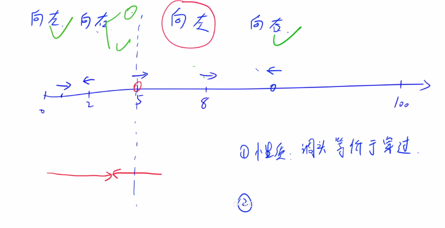
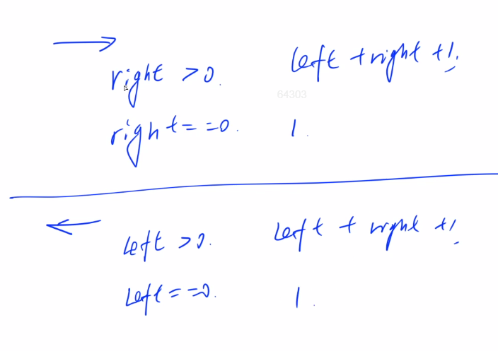
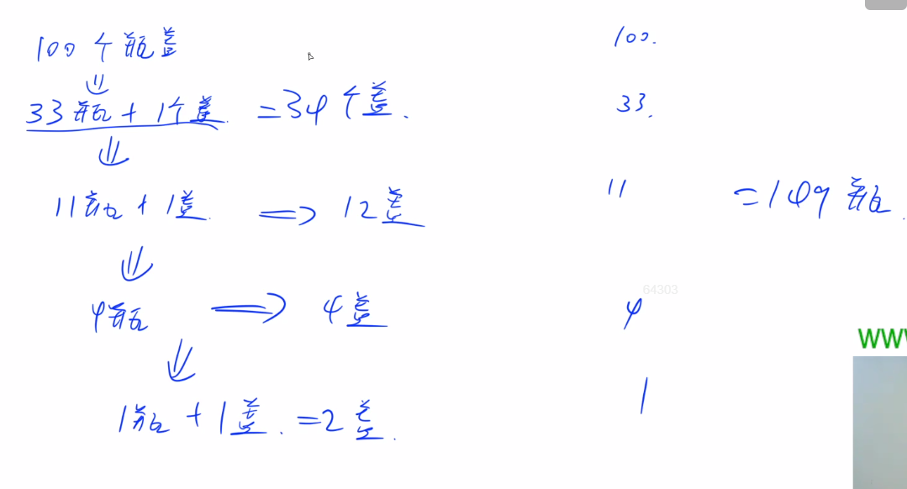
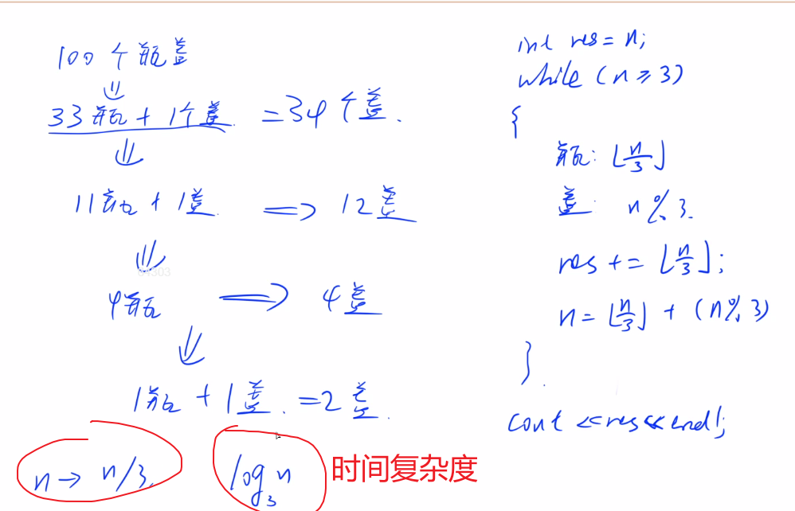

#### 1.2 acwing.1211. 蚂蚁感冒（第五届AB组）

<!--more-->

```C++
长 100 厘米的细长直杆子上有 n 只蚂蚁。
它们的头有的朝左，有的朝右。
每只蚂蚁都只能沿着杆子向前爬，速度是 1 厘米/秒。
当两只蚂蚁碰面时，它们会同时掉头往相反的方向爬行。
这些蚂蚁中，有 1 只蚂蚁感冒了。
并且在和其它蚂蚁碰面时，会把感冒传染给碰到的蚂蚁。
请你计算，当所有蚂蚁都爬离杆子时，有多少只蚂蚁患上了感冒。

输入格式
第一行输入一个整数 n, 表示蚂蚁的总数。
接着的一行是 n 个用空格分开的整数 Xi, Xi 的绝对值表示蚂蚁离开杆子左边端点的距离。
正值表示头朝右，负值表示头朝左，数据中不会出现 0 值，也不会出现两只蚂蚁占用同一位置。
其中，第一个数据代表的蚂蚁感冒了。

输出格式
输出1个整数，表示最后感冒蚂蚁的数目。

数据范围
1<n<50,
0<|Xi|<100
输入样例1：
3 
5 -2 8
输出样例1：
1
输入样例2：
5
-10 8 -20 12 25
输出样例2：
3
```

思路：

本题不属于任何算法。

首先要看出来，这里两只蚂蚁碰面掉头，其实等价于穿过去。掉头只是幌子，不要想复杂了。

因为相撞之后两只蚂蚁都感冒了，掉不掉头其实无所谓，毕竟都感冒了，这样的话这题就简单多了。



以第一只感冒蚂蚁**（向右走）**为分界，考虑左右两边的蚂蚁。


第一只感冒蚂蚁**（向左走）**情况类似。



```C++
// y总题解
#include <iostream>
#include <algorithm>
using namespace std;

const int N = 55;

int n;
int x[N];

int main(){
    cin >> n;
    for (int i = 0;i < n;i++) cin >> x[i];

    int left = 0,right = 0;
    // 分别表示左边向有走的蚂蚁数量，和右边向左走的蚂蚁数量
    for (int i = 1;i < n;i++)
        if (abs(x[i]) < abs(x[0]) && x[i] > 0) left++;
        else if (abs(x[i]) > abs(x[0]) && x[i] < 0) right++;

    if (x[0] > 0 && right == 0 || x[0] < 0 && left == 0) cout << 1;
    else cout << left + right + 1;
    return 0;
}
```

#### 1.3 acwing.1216. 饮料换购（第六届C++A/C组）

```C++
乐羊羊饮料厂正在举办一次促销优惠活动。乐羊羊C型饮料，凭3个瓶盖可以再换一瓶C型饮料，并且可以一直循环下去(但不允许暂借或赊账)。
请你计算一下，如果小明不浪费瓶盖，尽量地参加活动，那么，对于他初始买入的 n 瓶饮料，最后他一共能喝到多少瓶饮料。

输入格式
输入一个整数 n,表示初始买入的饮料数量。

输出格式
输出一个整数，表示一共能够喝到的饮料数量。

数据范围
0<n<10000
输入样例：
100
输出样例：
149
```

思路：

先手动模拟一下。





粗略计算一下，取n=10000时，每次除以3，大概需要迭代8,9次，时间完全没问题。

代码：

```C++
// y总题解
#include <iostream>
using namespace std;

int main(){
    int n;
    cin >> n;
    int res = n;
    while (n >= 3){
        res += n / 3;
        n = n / 3 + n % 3;
    }
    cout << res;
    return 0;
}
```

补充小知识：如何求上取整？

有一个公式，将上取整转化为下取整，因为C++计算int除法时默认下取整，$\lceil \frac a b \rceil = \lfloor \frac {a+b-1} b \rfloor$

证明如下：（PS：严格证明请参考[这里](https://blog.csdn.net/lanuage/article/details/78746606?ops_request_misc=&request_id=&biz_id=102&utm_term=%E6%80%8E%E4%B9%88%E6%B1%82%E5%90%91%E4%B8%8A%E5%8F%96%E6%95%B4&utm_medium=distribute.pc_search_result.none-task-blog-2~all~sobaiduweb~default-6-78746606.first_rank_v2_pc_rank_v29)）

分情况讨论：

1. 当`a mod b = 1,2,...,b-1`时，`(a mod b)+b-1 = b,b+1,...,b+b-2 `，这多余部分除以b下取整都是1，而左右两边的整数部分又相同，所以成立；（即`a%b != 0`时，上取整等于下取整+1）
2. 当`a mod b = 0`时，`(a mod b)+b-1 = b-1`，而$\frac {b-1}b$下取整是0，而左右两边的整数部分又相同，所以成立。（即`a%b = 0`时，上取整等于下取整）

向下取整的运算称为Floor，用数学符号⌊⌋表示；向上取整的运算称为Ceiling，用数学符号⌈⌉表示。

例如：

⌊59/60⌋=0	⌈59/60⌉=1	⌊-59/60⌋=-1	⌈-59/60⌉=0