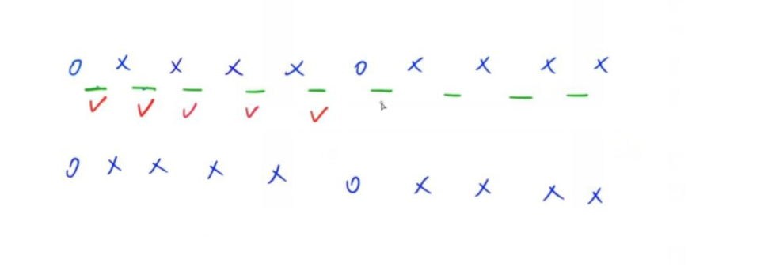
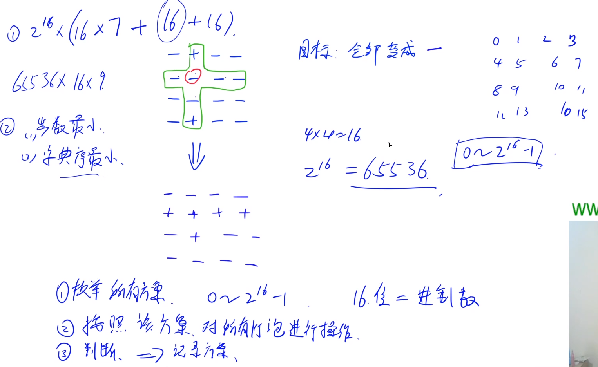

> 续蓝桥杯学习总结（三）。

<!--more-->

#### 3.3 acwing.1208. 翻硬币 （简单）

> 第四届C++ B组原题

小明正在玩一个“翻硬币”的游戏。

桌上放着排成一排的若干硬币。我们用 * 表示正面，用 o 表示反面（是小写字母，不是零）。

比如，可能情形是：`**oo***oooo`

如果同时翻转左边的两个硬币，则变为：`oooo***oooo`

现在小明的问题是：如果已知了初始状态和要达到的目标状态，每次只能同时翻转相邻的两个硬币,那么对特定的局面，最少要翻动多少次呢？

我们约定：把翻动相邻的两个硬币叫做一步操作。

```c++
输入格式
两行等长的字符串，分别表示初始状态和要达到的目标状态。

输出格式
一个整数，表示最小操作步数

数据范围
输入字符串的长度均不超过100。
数据保证答案一定有解。

输入样例1：
**********
o****o****
输出样例1：
5
输入样例2：
*o**o***o***
*o***o**o***
输出样例2：
1
```

思路：

想象一下，每两个硬币中间看作由一个灯泡控制。其实就是费解的开关的简化版。

模拟法：

从最左侧开始遍历，如果该位置硬币状态与目标不同，就翻动该位置和该位置后面的两枚硬币。
因为题目说了有解，所以遍历到倒数第二枚的时候，所有硬币状态就与目标相同了。



```c++
#include <iostream>
#include <cstdio>
#include <cstring>
using namespace std;
const int N = 110;
char start[N],aim[N];
void turn(int a)
{
    if (start[a] == '*') start[a] = 'o';
    else start[a] = '*';
}
int main()
{
    cin >> start >> aim;
    int res = 0;
    int n = strlen(start);
    for (int i=0;i<n-1;i++)
    {
        if (start[i] != aim[i])
        {
            turn(i),turn(i+1);
            res++;
        }
    }
    cout << res;
    return 0;
}
```

时间复杂度：遍历了一边输出，时间复杂度是 O(n)。

该思路时间复杂度已是最优，要使起始状态变为目标状态，至少遍历一边来进行判断，时间复杂度最少是 O(n)。

空间复杂度：没有开辟与输入输出有关的空间，空间复杂度是O(1)。

#### 3.4 acwing.116.飞行员兄弟 （超长代码预警）

“飞行员兄弟”这个游戏，需要玩家顺利的打开一个拥有 16个把手的冰箱。

已知每个把手可以处于以下两种状态之一：打开或关闭。

只有当所有把手都打开时，冰箱才会打开。

把手可以表示为一个 4×4 的矩阵，您可以改变任何一个位置 [i,j]上把手的状态。

但是，这也会使得第 i 行和第 j列上的所有把手的状态也随着改变。

请你求出打开冰箱所需的切换把手的次数最小值是多少。

```c++
输入格式
输入一共包含四行，每行包含四个把手的初始状态。
符号 + 表示把手处于闭合状态，而符号 - 表示把手处于打开状态。
至少一个手柄的初始状态是关闭的。

输出格式
第一行输出一个整数 N，表示所需的最小切换把手次数。
接下来 N 行描述切换顺序，每行输出两个整数，代表被切换状态的把手的行号和列号，数字之间用空格隔开。
注意：如果存在多种打开冰箱的方式，则按照优先级整体从上到下，同行从左到右打开。

数据范围
1≤i,j≤4
输入样例：
-+--
----
----
-+--
输出样例：
6
1 1
1 3
1 4
4 1
4 3
4 4
```

Solution 1:数组枚举法，对于所有操作暴力枚举



注意：题中如果存在多种打开冰箱的方式，则按照优先级整体从上到下，同行从左到右打开。

```c++
// y总题解
#include <iostream>
#include <cstring>
#include <vector>
#define x first
#define y second  // 简化
using namespace std;
typedef pair<int,int> PII;
const int N = 5;
char g[N][N],backup[N][N];
int get(int x,int y)
{
    return x*4 + y; // 求二维坐标对应的0,1,2,...,15中的映射
}
void turn_one(int x,int y)
{
    if (g[x][y] == '+') g[x][y] = '-';
    else g[x][y] = '+';
}
// 把十字上的把手都反转
void turn_all(int x,int y)
{
    for (int i=0;i<4;i++)
    {
        turn_one(x,i);
        turn_one(i,y);
    }
    turn_one(x,y);//前面操作把手两次，所以要多操作一次
}
int main()
{
    for (int i = 0;i < 4;i++) cin >> g[i];
    vector<PII> res; // 存放最终答案
    for (int op = 0;op < 1 << 16;op++)
    {
        vector<PII> temp; // 存放当前答案
        memcpy(backup,g,sizeof g); // 备份
        
        // 根据枚举的op进行反转操作
        for (int i = 0;i < 4;i++)
            for (int j = 0;j < 4;j++)
            {
                if (op >> get(i,j) & 1)
                {
                    temp.push_back({i,j});
                    turn_all(i,j);
                }
            }
        // 判断是否满足把手全部打开
        bool has_closed = false;
        for (int i = 0;i < 4;i++)
            for (int j = 0;j < 4;j++)
            {
                if (g[i][j] == '+')
                {
                    has_closed = true;
                    break;
                }
            }
        if(has_closed == false)
        {
             // 判断res是否已经求出或是否最优解
            if (res.empty() || res.size()>temp.size()) res = temp;
        }
        memcpy(g,backup,sizeof g);  // 还原
    }
    cout <<res.size() << endl;
    for (auto op:res) cout << op.x + 1 << ' '<<op.y+1<<endl; 
    // 输出实际坐标
    return 0;
}
```

Solution 2:枚举+位运算法，对solution1的二进制优化

看不懂的话请参考：[算法2：枚举+位运算](https://www.acwing.com/solution/content/983/)

```c++
// y总题解
#include <cstring>
#include <iostream>
#include <algorithm>
#include <vector>
using namespace std;
typedef pair<int,int> PII;
const int N = 4, INF = 100;

int change[N][N];

int get(int x, int y)
{
    return x * N + y;
}

int main()
{
    for (int i = 0; i < N; i ++ )// change每个位置二进制表示将哪些位置取反
        //对照着solution1的turn_all & turn_one函数就比较好理解啦
        for (int j = 0; j < N; j ++ )
        {
            for (int k = 0; k < N; k ++ ) change[i][j] += (1 << get(i, k)) + (1 << get(k, j));
            change[i][j] -= 1 << get(i, j);
        }

    int state = 0;// state用于存放所有把手的当前状态
    for (int i = 0; i < N; i ++ )
    {
        string line;
        cin >> line;
        for (int j = 0; j < N; j ++ )
            if (line[j] == '+')
                state += 1 << get(i, j);
    }

    vector<PII> path;
    for (int i = 0; i < 1 << 16; i ++ )// 枚举对把手的所有操作
    {
        int now = state;
        vector<PII> temp;
        for (int j = 0; j < 16; j ++ )
            if (i >> j & 1) // 求i的第j位数字
            {
                int x = j / 4, y = j % 4;
                now ^= change[x][y]; // 对now的把手进行反转，异或取反
                temp.push_back({x, y});
            }
        // 判断解存在且是最优解
        if (!now && (path.empty() || path.size() > temp.size())) path = temp;
    }

    cout << path.size() << endl;
    for (auto &p : path)
        cout << p.first + 1 << ' ' << p.second + 1 << endl;

    return 0;
}
```

Solution 3:DFS法

对于每个把手，有选和不选两种情况。

这种写法满足题意：如果存在多种打开冰箱的方式，则按照优先级整体从上到下，同行从左到右打开。

```c++
// dalao的优化版本，比solution1快了近10倍
#include <iostream>
#include <cstdio>
#include <cstring>
#include <algorithm>
#include <vector>
using namespace std;
typedef pair<int, int> PII;
const int N = 5;
char g[N][N];
vector<PII> ans, tmp;

void turn_one(int x, int y)
{
    if (g[x][y] == '+') g[x][y] = '-';
    else g[x][y] = '+';
}

void turn_all(int x, int y)
{
    for (int i = 0; i < 4; i++)
    {
        turn_one(x, i);
        turn_one(i, y);
    }
    turn_one(x, y);
}

void dfs(int x, int y)
{
    // 如果说所有的把手都操作完了就看看冰箱能否打开
    if (x == 3 && y == 4)
    {
        bool success = true;
        for (int i = 0; i < 4; i++)
            for (int j = 0; j <4; j++)
                if (g[i][j] == '+')
                {    
                    success = false;
                    goto end;
                }
        end:
        if (success)
            // 判断是否最优解
            if (ans.empty() || tmp.size() < ans.size())
                ans = tmp;
        return;// 递归结束千万记得退出
    }
    // 判断边界，如果y出界了就往下一行移动
    if (y == 4) x++, y = 0;
    // 操作把手(x, y)
    turn_all(x, y);
    tmp.push_back({ x, y });
    dfs(x, y + 1);
    // 恢复现场，关键所在
    tmp.pop_back();
    turn_all(x, y);
    // 不操作把手(x, y)
    dfs(x, y + 1);

}
int main()
{
    for (int i = 0; i < 4; i++) scanf("%s", g[i]);
    // 从(0, 0)开始DFS
    dfs(0, 0);
    cout << ans.size() << endl;
    for (int i = 0; i < ans.size(); i++) 
        printf("%d %d\n", ans[i].first + 1, ans[i].second + 1);
    return 0;
}
```


