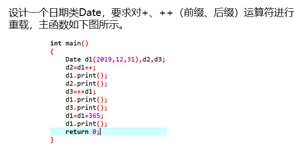

如题：题目要求根据初始化时的日期加上一定的天数后计算得到的日期，这里用到的计算思路来自[这里](https://grant1499.github.io/2021/03/26/%E6%97%A5%E6%9C%9F%E5%A4%84%E7%90%86%E4%B8%8E%E8%BF%9B%E5%88%B6%E8%BD%AC%E6%8D%A2%E9%97%AE%E9%A2%98/)。

<!--more-->



只要稍做改动，就能写出代码来了，不过要注意原题计算的是日期差+1！

这题主要考察了日期问题、++前缀与后缀重载等知识点。

```C++
#include <iostream>
#include <cstdio>
using namespace std;
// 判断闰年，是闰年返回true
bool isLeap(int y){
    return (y%4==0 &&y%100!=0) || (y%400==0);
}
//顺序存放平年、闰年每月对应天数
int month[13][2] = {
	{0,0},{31,31},{28,29},{31,31},{30,30},{31,31},{30,30},
	{31,31},{31,31},{30,30},{31,31},{30,30},{31,31}
};

class Date{
    public:
        Date(){
            y = 2000,m = 1,d = 1;
        }
        Date(int _y,int _m,int _d):
        y(_y),m(_m),d(_d){}
        // Copy Constructor
        Date(Date& t){
            y = t.y,m = t.m,d = t.d;
        }
        void print(){
            printf("Y:%d,M:%2d,D:%2d\n",y,m,d);
        }
        friend Date operator+ (Date& D,int n);// 重载加号
        friend Date operator++ (Date& D,int);// 重载后缀++
        friend Date operator++ (Date& D);// 重载++前缀
    private:
        int y;
        int m;
        int d;
};
Date operator+ (Date& D,int n){
    Date temp = D;
    int ans = 0;// 累加ans到n
    // ans == n退出
    while (ans < n){
        // 优化，降低循环次数
        if (n- ans > 366){
            
            if (isLeap(temp.y)) ans += 366;
            else ans += 365;
            temp.y ++;
            continue;
        }
        temp.d ++;
        if (temp.d == month[temp.m][isLeap(temp.y)]+1){
            temp.d = 1;temp.m ++;
        }
        if (temp.m == 13){
            temp.m = 1;temp.y ++;
        }
        ans ++;
    }
    return temp;
}
// 重载后缀++
Date operator++ (Date& D,int){
    Date temp = D;
    D.d ++;
    if (D.d == month[D.m][isLeap(D.y)]+1){
        D.d = 1;D.m ++;
    }
    if (D.m == 13){
        D.m = 1;D.y ++;
    }
    return temp;
}
// 重载++前缀
Date operator++ (Date& D){
    D.d ++;
    if (D.d == month[D.m][isLeap(D.y)]+1){
        D.d = 1;D.m ++;
    }
    if (D.m == 13){
        D.m = 1;D.y ++;
    }
    return D;
}
int main(){
    Date d1(2019,12,31),d2,d3;
    d2 = d1++;
    d1.print();
    d2.print();
    d3 = ++d1;
    d1.print();
    d3.print();
    d1 = d1 + 365;
    d1.print();
    return 0;
}
```

