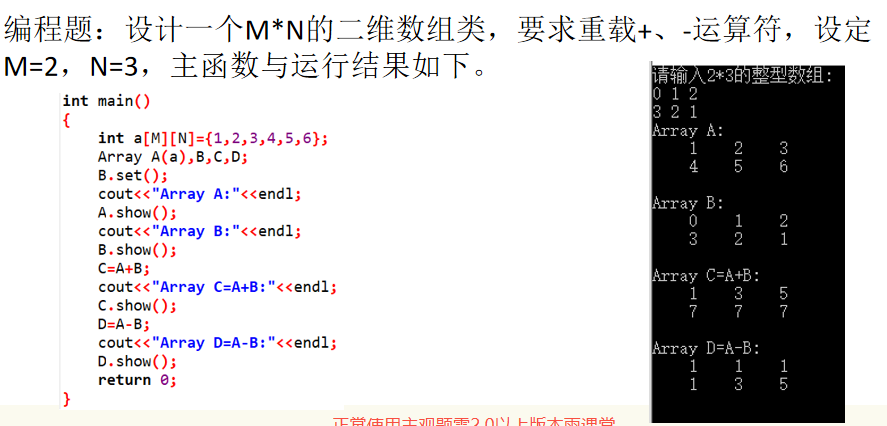

如题：设计一个M*N的二维数组类，要求重载+、-运算符。

<!--more-->



```C++
#include <cstdio>
#include <cstring>
#include <iostream>
using namespace std;
const int M = 2;
const int N = 3;
class Array{
	public:
        Array(){}
		Array(int n[M][N]){
            for (int i = 0;i < M;i ++)
			    memcpy(arr[i],n[i],sizeof(n[N]));
		}
        void show(){
            for (int i = 0;i < M;i++){
                for (int j = 0;j < N;j++){
                    cout << '\t' << arr[i][j];
                }
                puts("");
            }
        }
        void set(){
            cout << "请输入2*3的整型数组：\n";
            for (int i = 0;i < M;i++)
                for (int j = 0;j < N;j++) cin >> arr[i][j];
        }
        Array operator+ (Array& a){
                Array temp;
                for (int i = 0;i < M;i++){
                    for (int j = 0;j < N;j++){
                        temp.arr[i][j] = this->arr[i][j]+a.arr[i][j];
                    }
                }
                return temp;
        }
        Array operator- (Array& a){
                Array temp;
                for (int i = 0;i < M;i++){
                    for (int j = 0;j < N;j++){
                        temp.arr[i][j] = this->arr[i][j]-a.arr[i][j];
                    }
                }
                return temp;
        }
	private:
		int arr[M][N];
};
int main(){
	int a[M][N] = {1,2,3,4,5,6};
	Array A(a),B,C,D;
	B.set();
	cout << "Array A:" << endl;
	A.show();
	cout << "Array B:" << endl;
	B.show();
	C = A + B;
	cout << "Array C=A+B:" << endl;
	C.show();
	D = A - B;
	cout << "Array D=A-B:" << endl;
	D.show();
	return 0;
}
```

