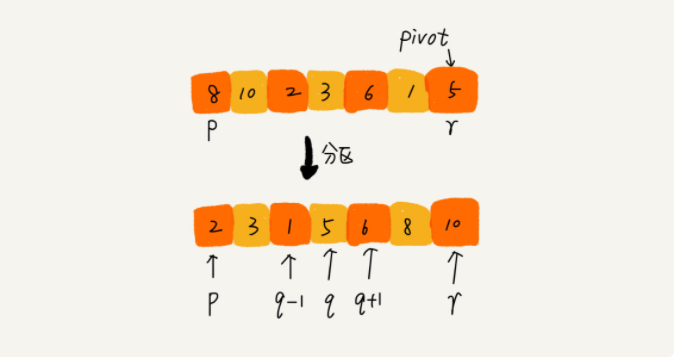
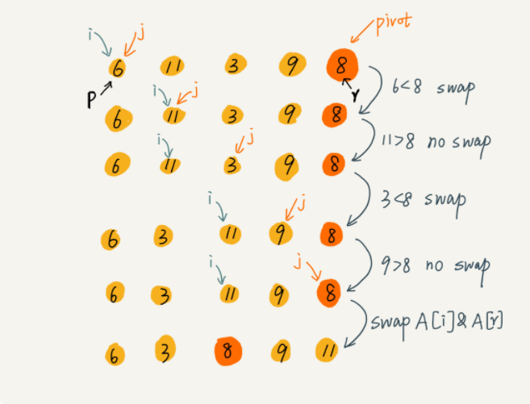
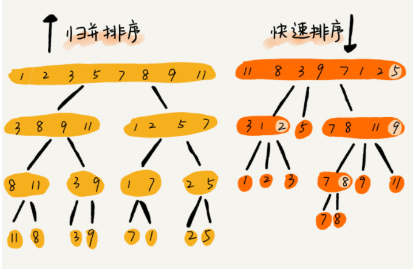

# 高等排序算法

参考：极客时间数据结构与算法之美专栏

非常推荐，王争老师写的很棒！

<!--more-->

## 1.如何用快排思想在O(n)内查找第K大元素？

本文会以这个问题为主线，介绍一些高等排序算法。

在初等排序中介绍的几种算法的时间复杂度都是$O(n^2)$。

接下来会介绍归并排序与快速排序，适合大规模的数据排序，比初等排序算法要更常用。

归并排序和快速排序都用到了分治思想，非常巧妙。

## 2.Merge Sort（归并排序）

归并排序见我的另一篇[文章](https://www.grantdrew.top/posts/2aed1d1d.html)。

在[蓝桥杯学习总结（十五）](https://www.grantdrew.top/posts/2e5ddee.html)中有y总归并排序板子。

这里不再重复介绍。

## 3.Quick Sort（快速排序）

时间复杂度：$O(nlogn)$.

快排利用的也是分治思想。乍看起来，它有点像归并排序，但是思路其实完全不一样。

快排的思想是这样的：如果要排序数组中下标从 p 到 r 之间的一组数据，我们选择 p 到 r 之间的任意一个数据作为 pivot（分区点）。

我们遍历 p 到 r 之间的数据，将小于 pivot 的放到左边，将大于 pivot 的放到右边，将 pivot 放到中间。经过这一步骤之后，数组 p 到 r 之间的数据就被分成了三个部分，前面 p 到 q-1 之间都是小于 pivot 的，中间是 pivot，后面的 q+1 到 r 之间是大于 pivot 的。



根据分治、递归的处理思想，我们可以用递归排序下标从 p 到 q-1 之间的数据和下标从 q+1 到 r 之间的数据，直到区间缩小为 1，就说明所有的数据都有序了。

归并排序中有一个 merge() 合并函数，我们这里有一个 partition() 分区函数。就是随机选择一个元素作为 pivot（一般情况下，可以选择 p 到 r 区间的最后一个元素），然后对 A[p...r]分区，函数返回 pivot 的下标。

如果我们不考虑**空间消耗**的话，partition() 分区函数可以写得非常简单。我们申请两个临时数组 X 和 Y，遍历 A[p...r]，将小于 pivot 的元素都拷贝到临时数组 X，将大于 pivot 的元素都拷贝到临时数组 Y，最后再将数组 X 和数组 Y 中数据顺序拷贝到 A[p....r]。

这样写：

```Java
private static int partition(int[] a, int p, int r) {
    int pivot = a[p];
    while (p < r){
        while (p < r && a[r] > pivot) r--;
        a[p] = a[r];
        while (p < r && a[r] <= pivot) p++;
        a[r] = a[p];
    }
    a[p] = pivot;
    return p;
}
```

但是，如果按照这种思路实现的话，partition() 函数就需要很多额外的内存空间，所以快排就不是原地排序算法了。如果我们希望快排是**原地排序算法**，那它的空间复杂度得是 O(1)，那 partition() 分区函数就不能占用太多额外的内存空间，我们就需要在 A[p...r]的原地完成分区操作。

原地分区这样写：

```pascal
// 伪代码
partition(A, p, r) {
  pivot := A[r]
  i := p
  for j := p to r-1 do {
    if A[j] < pivot {
      swap A[i] with A[j]
      i := i+1
    }
  }
  swap A[i] with A[r]
  return i
```

这里的处理有点类似**选择排序**。我们通过游标 i 把 A[p...r-1]分成两部分。A[p...i-1]的元素都是小于 pivot 的，我们暂且叫它“已处理区间”，A[i...r-1]是“未处理区间”。我们每次都从未处理的区间 A[i...r-1]中取一个元素 A[j]，与 pivot 对比，如果小于 pivot，则将其加入到已处理区间的尾部，也就是 A[i]的位置。

数组的插入操作还记得吗？在数组某个位置插入元素，需要搬移数据，非常耗时。当时我们也讲了一种处理技巧，就是**交换**，在 O(1) 的时间复杂度内完成插入操作。这里我们也借助这个思想，只需要将 A[i]与 A[j]交换，就可以在 O(1) 时间复杂度内将 A[j]放到下标为 i 的位置。



因为分区的过程涉及交换操作，如果数组中有两个相同的元素，比如序列 6，8，7，6，3，5，9，4，在经过第一次分区操作之后，两个 6 的相对先后顺序就会改变。所以，快速排序并不是一个稳定的排序算法。

对照上面图片会更容易理解。

```Java
// Java写法
public class QuickSort {

  // 快速排序，a是数组，n表示数组的大小
  public static void quickSort(int[] a, int n) {
    quickSortInternally(a, 0, n-1);
  }

  // 快速排序递归函数，p,r为下标
  private static void quickSortInternally(int[] a, int p, int r) {
    if (p >= r) return;

    int q = partition(a, p, r); // 获取分区点
    quickSortInternally(a, p, q-1);
    quickSortInternally(a, q+1, r);
  }

  private static int partition(int[] a, int p, int r) {
    int pivot = a[r];
    int i = p;
    for(int j = p; j < r; ++j) {
      if (a[j] < pivot) {
        if (i == j) {// 相等说明a[i]和a[j]是同一个数
          ++i;
        } else {// 不等则交换a[i]和a[j]
          int tmp = a[i];
          a[i++] = a[j];
          a[j] = tmp;
        }
      }
    }

    int tmp = a[i];
    a[i] = a[r];
    a[r] = tmp;

    System.out.println("i=" + i);
    return i;
  }
}
```

## 4.归并与快排的区别



可以发现，归并排序的处理过程是**由下到上**的，先处理子问题，然后再合并。而快排正好相反，它的处理过程是**由上到下**的，先分区，然后再处理子问题。归并排序虽然是稳定的、时间复杂度为 O(nlogn) 的排序算法，但是它是非原地排序算法。我们前面讲过，归并之所以是非原地排序算法，主要原因是合并函数无法在原地执行。快速排序通过设计巧妙的原地分区函数，可以实现原地排序，解决了归并排序占用太多内存的问题。

快速排序算法虽然最坏情况下的时间复杂度是 O(n^2)，但是平均情况下时间复杂度都是 O(nlogn)。不仅如此，快速排序算法时间复杂度退化到 O(n^2) 的概率非常小，我们可以通过合理地选择 pivot 来避免这种情况。

## 5.解答开篇

快排核心思想就是分治和分区，我们可以利用分区的思想，来解答开篇的问题：O(n) 时间复杂度内求无 序数组中的第 K 大元素。比如，4， 2， 5， 12， 3 这样一组数据，第 3 大元素就是 4。

我们选择数组区间 A[0...n-1]的最后一个元素 A[n-1]作为 pivot，对数组 A[0...n-1]原地分区，这样数组就分成了三部分，A[0...p-1]、A[p]、A[p+1...n-1]。

如果 p+1=K，那 A[p]就是要求解的元素；如果 K>p+1, 说明第 K 大元素出现在 A[p+1...n-1]区间，我们再按照上面的思路递归地在 A[p+1...n-1]这个区间内查找。同理，如果 K<p+1，那我们就在 A[0...p-1]区间查找。

时间复杂度是 O(n)。

第一次分区查找，我们需要对大小为 n 的数组执行分区操作，需要遍历 n 个元素。第二次分区查找，我们只需要对大小为 n/2 的数组执行分区操作，需要遍历 n/2 个元素。

如果我们把每次分区遍历的元素个数加起来，就是：n+n/2+n/4+n/8+...+1。这是一个等比数列求和，最后的和等于 2n-1。所以，上述解决思路的时间复杂度就为 O(n)。